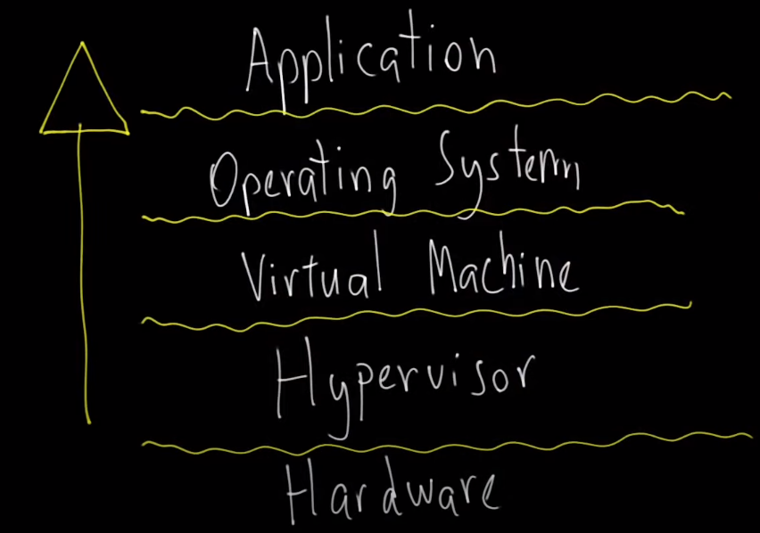
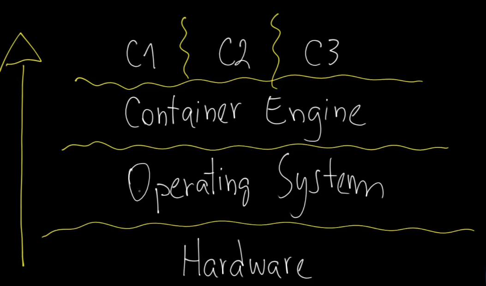

# Docker

&emsp;This is a self-made resume for studying Docker. Here you will find both theoretical information and practical hands-on exercises. Feel free to use it and/or make pull-requests!</br>

&emsp;Special thanks to [Mateus Muller](https://mateusmuller.me/), who inspired me to build this resume. Part of this content is based on his [video](https://www.youtube.com/watch?v=RE31GWJGkwA&ab_channel=MateusMuller).</br>
&emsp;Check out the [references](#references-and-other-content) for additional content that I found important while studying Docker and related topics.</br>

## Authors

- [Orlando Mota Pires](https://github.com/orlandomotapires)

---

## Summary

[Before Container](#before-container)</br>
[Container Idea](#container-idea)</br>
[Docker Architecture](#docker-architecture)</br>
[Installing Docker](#installing-docker)</br>
[Creating a Docker image](#creating-a-docker-image)</br>
[Docker Image Creation Hands-On](#docker-image-creation-hands-on)</br>

---

## **Before Container**



&emsp;Before containers, hypervisors were used. Hypervisors are still in use today but require many additional components: Hardware, HyperVisor, Virtual Machine, Operating System, and finally the application. This setup makes launching an app more complex.</br>
&emsp;Three disadvantages come with using hypervisors: poor hardware utilization (since each app needs a full OS and dedicated hardware), difficult library management (due to potential library deprecation and different versions needed by the app and OS), and immutability issues (since environments can differ).</br>

## **Container Idea**



&emsp;Containers simplify the setup by reducing the required components to Hardware, OS, Container Engine, and the containers themselves. All containers use the same Container Engine and hardware, preventing poor hardware utilization.</br>
&emsp;Containers offer several advantages: resource optimization, simplified application packaging (solving the library version problem), immutability (each container is identical), and ease of deployment.</br>

## **Installing Docker**

&emsp;Installing Docker is straightforward with simple copy-paste commands. Follow the official guide linked below.</br>

- [Official Docker Installation Guide](https://docs.docker.com/engine/install/)

&emsp;After installation, you might encounter a permission error when trying to use the Docker client (`docker` command). This happens because your user isn't in the Docker group by default. Add your user to the group manually by following the post-installation steps in the official documentation below.</br>


- [Docker Post-Installation Guide](https://docs.docker.com/engine/install/linux-postinstall/)

## **Docker Architecture**


&emsp;Docker consists of three main parts: Client, Docker Host, and Registry.</br>

- **Client**: The command line interface used to interact with Docker (e.g., `docker images`).
- **Docker Host**: Also known as Docker Daemon, it's the service running Docker. You can interact with it using the Client, even if the Host is on a different machine.
- **Registry**: A storage for Docker images. DockerHub is the most famous registry.

## **Creating a Docker image**


&emsp;A Dockerfile is a text file with instructions on how to create a Docker image. Important parameters include:</br>

- `FROM`: Base image for the new image.
- `RUN`: Commands to run inside the image (e.g., installing packages).
- `COPY`: Copy files into the image.
- `ENV`: Declare environment variables.
- `CMD`: Command to run when the container starts.

&emsp;Each instruction in the Dockerfile creates a layer in the image, making it efficient to create and manage containers. The image is immutable and read-only, while the container is read-write.</br>

## **Docker Image Creation Hands-On**

&emsp;Let's create a Docker image using a Flask application.</br>

1. **Create `app.py`**: Write your Flask application code.
2. **Set up a virtual environment**:
    ```sh
    python3 -m venv .venv
    ```
3. **Activate the virtual environment**:
    ```sh
    source .venv/bin/activate
    ```
4. **Install Flask**:
    ```sh
    pip install flask
    ```
5. **Test the application**:
    ```sh
    flask run
    ```
6. **Create a Dockerfile**:
    ```dockerfile
    # Use a base image
    FROM python:3.10-bullseye

    # Set working directory
    WORKDIR /app

    # Copy dependencies
    COPY requirements.txt requirements.txt

    # Install dependencies
    RUN pip install -r requirements.txt

    # Copy application code
    COPY . .

    # Set environment variables
    ENV FLASK_APP=app.py

    # Run the application
    CMD ["flask", "run", "--host=0.0.0.0"]
    ```

7. **List dependencies**:
    ```sh
    pip freeze > requirements.txt
    ```
8. **Build the Docker image**:
    ```sh
    docker build -t flask-app:dev-0.0.1 .
    ```
9. **Check the image**:
    ```sh
    docker images
    ```
10. **Run the container**:
    ```sh
    docker run -d -P flask-app:dev-0.0.1
    ```
11. **Check running containers**:
    ```sh
    docker ps
    ```
12. **Access the application**: Open `localhost:{PORT}` in your browser.
13. **Check logs**:
    ```sh
    docker logs {CONTAINER_ID} -f
    ```
14. **Execute commands inside the container**:
    ```sh
    docker exec {CONTAINER_ID} ls
    docker exec -it {CONTAINER_ID} bash
    ```

## **Main Docker Commands and Their Uses**

- **`docker build`**: Builds an image from a Dockerfile.
    ```sh
    docker build -t image_name:tag .
    ```
- **`docker images`**: Lists all Docker images on the system.
    ```sh
    docker images
    ```
- **`docker run`**: Runs a container from an image.
    ```sh
    docker run -d -P image_name:tag
    ```
- **`docker ps`**: Lists all running containers.
    ```sh
    docker ps
    ```
- **`docker stop`**: Stops a running container.
    ```sh
    docker stop container_id
    ```
- **`docker rm`**: Removes a stopped container.
    ```sh
    docker rm container_id
    ```
- **`docker rmi`**: Removes an image.
    ```sh
    docker rmi image_name:tag
    ```
- **`docker logs`**: Shows logs for a container.
    ```sh
    docker logs container_id -f
    ```
- **`docker exec`**: Runs a command in a running container.
    ```sh
    docker exec container_id command
    docker exec -it container_id bash
    ```
- **`docker pull`**: Pulls an image from a registry.
    ```sh
    docker pull image_name:tag
    ```
- **`docker push`**: Pushes an image to a registry.
    ```sh
    docker push image_name:tag
    ```

## **References and other content**

1. <https://www.youtube.com/watch?v=RE31GWJGkwA&ab_channel=MateusMuller>
2. <https://docs.docker.com/get-docker/>
3. <https://docs.docker.com/engine/reference/builder/>
4. <https://docs.docker.com/storage/storagedriver/overlayfs-driver/>
5. <https://man7.org/linux/man-pages/man7/namespaces.7.html>
6. <https://itsfoss.com/linux-daemons/>
7. <https://flask.palletsprojects.com/en/2.2.x/quickstart/?highlight=quickstart>
